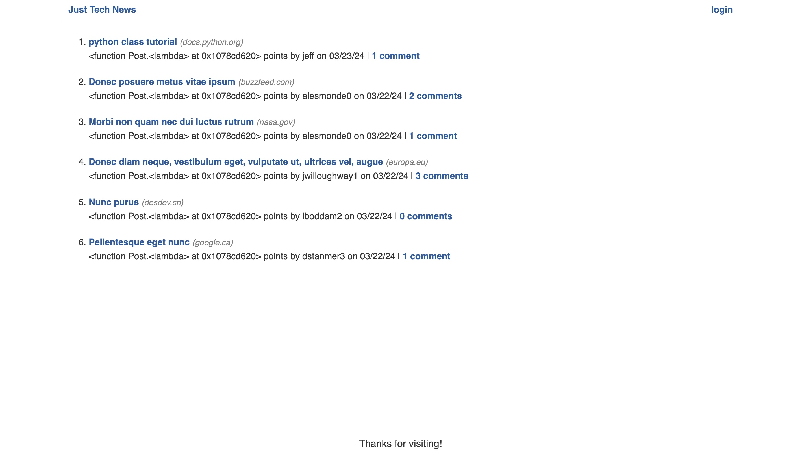
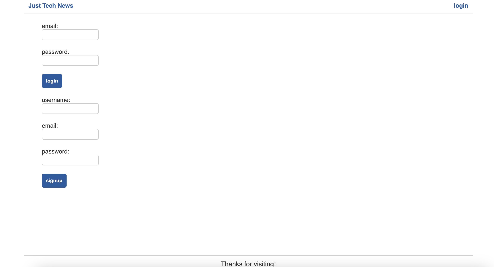
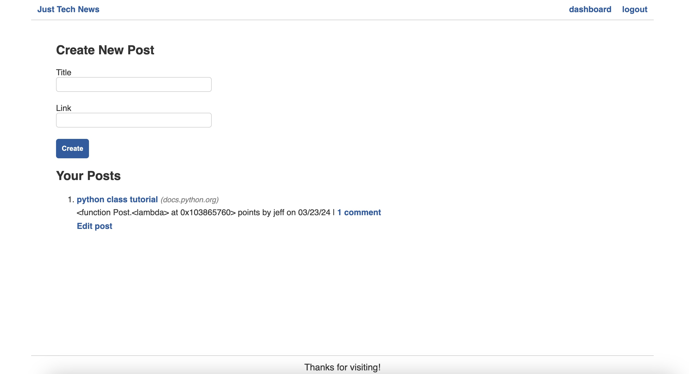
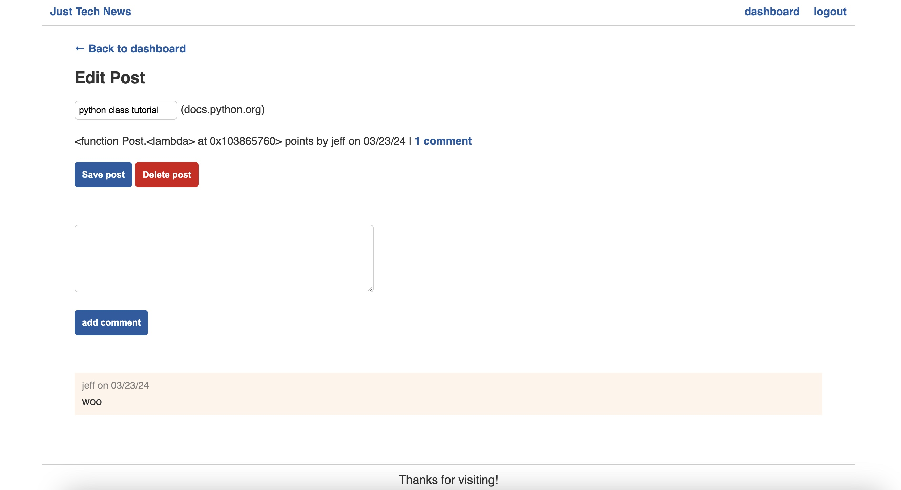

# Tech-Newsfeed

## Description

Check out this Python application that was built with the goal of making it easier for tech enthusiasts to stay updated with the latest developments in the industry. The application allows users to:

*Sign Up and Log In: Users can create an account to personalize their experience, including saving favorite articles and participating in discussions.

*Browse and Search News: Explore a wide range of news articles from different sources. Users can search for specific topics or browse through categories like technology, science, and more.

*Create and Share Posts: Users can share their own articles or thoughts on the latest tech news. They can also upvote and comment on posts shared by others.

*Engage with the Community: Participate in discussions, upvote posts, and share your insights with the community. The application encourages interaction and knowledge sharing among users.

## Usage

To use Tech-Newsfeed, simply navigate to the application's URL () and start exploring the latest tech news. Users can sign up for an account to access additional features like saving favorite articles and participating in discussions.

Here is a view of the homepage where you can see the feed.

Here is a view of the login and signup.

Here is a view of the create page.

Here is a view of the edit post page.

## License

Tech-Newsfeed is open-source software licensed under the MIT License. See the LICENSE file for more details.

